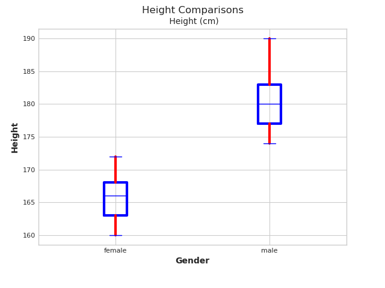

# Simple Gender Classification

- This dataset has some data that can be associated with an individual in the form of an individual along with the target variable of their gender
- There are 8 such variables excluding the target variable of gender (Age, Height, Weight, Occupation, Education Level, Marital Status, Income, Favorite Color)
- Since we are predicting a decision boundary of sorts to divide Male and Female datapoints this is a classification problem
- There are around 131 datapoints in this dataset, which means that a careful divide of dataset is required to achieve an adequate training set and at the same time have a solid test set to avoid false results in model accuracy
- There is a sufficient amount of data-preprocessing required with this dataset which has been described through the following passages

### Pre_requisites
- These are the specs with which this project has been created

| **Requirement** | **Version** |
|-----------------|-------------|
| python          | 3.8         |
| pandas          | 1.4.1       |
| scikit-learn    | 1.0.2       |
| seaborn         | 0.11.2      |
| matplotlib      | 3.2.2       |


### Initial Data-PreProcessing

- The first step of the way was to check if there were any NaN, NULL values in the dataset that might bias or distort the decision boundary for worse
- No column containing valid, useful data had any NaN/NULL values.
- The last column in the dataset was all NaN values and hence was removed from the pandas frame
```python
nan_columns = self.main_frame.columns[self.main_frame.isna().any()].tolist()
        for col in nan_columns:
            col = int(re.findall(r'\d$', col)[0])
            sum_na = self.main_frame.iloc[:, col].isna().sum()
            if sum_na == self.main_frame.shape[0]:
                self.main_frame.drop(self.main_frame.columns[col], axis=1, inplace=True)
```
- Across the dataframe we found a bunch of values with trailing and leading whitespaces that were inducing un-necessary categories/classes
- We have used the strip function to remove those spaces and create a dataframe with uniform structure and unique categories/classes for data and target variable
```python
    def strip_spaces(self):
        # Gather the Columns that have Strings as data type
        string_objects = self.main_frame.select_dtypes(['object'])

        # Strip trailing/leading whitespaces from the Strings
        self.main_frame[string_objects.columns] = string_objects.apply(lambda x: x.str.strip())
        print('String values stripped of trailing and leading whitespaces')
```

### Statistical Representation of the Dataset
|         | Age    | Height (cm) | Weight (kg) | Income (USD) |
|---------|--------|-------------|-------------|--------------|
| Count   | 131    | 131         | 131         | 131          |
| Mean    | 34.564 | 173.198     | 71.4580     | 93206.1068   |
| Std Dev | 5.9847 | 8.0454      | 12.6480     | 74045.3829   |
| Minimum | 24     | 160         | 50          | 30000        |
| Maximum | 52     | 190         | 94          | 500000       |

### Statistical Divide between classes (by numbers)
- We have used __Box and Whisker plots__ to show this divide between the two classes of data through which we will be trying to define a boundary
- This will show where the majority of our data points are with each class and also help us determine if there are any significant outliers. __[1]__

#### __Age__


#### __Height__


#### __Income__


#### __Weight__


### Statistical Divide between classes (by categories)
- There are other variables except the numerical ones that also form a significant part of this dataset
- Since they are categorical variables, there is a possibility of a number of categories being available, hence we have used __stacked bar graphs__ to show all the categories effectively for both the classes

#### __Occupations__


#### __Education__


#### __Marital Status__


#### __Favorite Color__


### Final Data-PreProcessing

- We have categorical data still available after visualizing the data and its important aspects
- This data would be a hinder an effective model creation for this problem, so we have to find a way to convert them into numbers
- We know that these categories do not have any relation amongst themselves, so simply numbering them might signify to the model that one category is important  than other or vice-versa
- That's where we use one hot encoding, to take this factor out.
- Scikit-learn library's OneHotEncoder allows us to instead turn these categories into vectors of zeroes and ones
- Although it increases the size of features, but the model becomes much more accurate
- The increase in size also won't slow down our eventual model since the number of data-points are also low
```python
    def encoding_categorical(self):
        # Initialise Encoder
        onehotencoder = OneHotEncoder()

        # Get all the Categorical Columns
        string_objects = self.x_block.select_dtypes(['object'])

        # Encode those columns
        encoded_columns = onehotencoder.fit_transform(self.x_block[string_objects.columns]).toarray()

        # Create a dataframe with encoded columns
        onehot_df = pandas.DataFrame(encoded_columns, columns=onehotencoder.get_feature_names(string_objects.columns))

        # Drop the still categorical columns from the original dataframe
        self.x_block.drop(string_objects.columns, axis=1, inplace=True)

        # Concatenate the Encoded Columns in the original frame
        self.x_block = pandas.concat([self.x_block, onehot_df], axis=1)
```

### References
[1]. https://www.tableau.com/ [Plots to best describe our data]

[2]. https://matplotlib.org/ [Visualizations]

[3]. https://pandas.pydata.org/docs/ [Data Pre-Processing]

[4]. https://numpy.org/doc/stable/ [Data Pre-Processing]